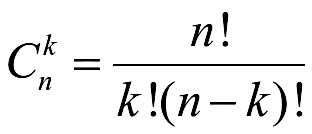

# Решение задач по теорверу из учебника Чистякова (гдз, решебник)

Решение 67 заданий из сборника Чистякова "Теория вероятности", чтобы закрыться в 3 семестре по предмету "Теория вероятности" в ИТМО у Кудашова Вячеслава Николаевича

- [Глава 3. 10 заданий](./chapter3.md)
- [Глава 4. 10 заданий](./chapter4.md)
- [Глава 5. 10 заданий](./chapter5.md)
- [Глава 7. 1 задание](./chapter7.md)

В markdown на гитхабе нет нормального форматирования бинома, поэтому часто можете увидеть \binomnk, что равно:

Накиньте звёздочку, што ле)))
